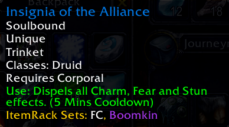
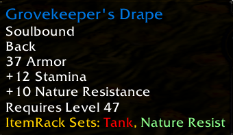

# ItemRack Sets Tooltip

WoW Addon to shows tooltip for ItemRack sets 





Sets with the following names (case sensitive) will have specific colors in the tooltip, the default color is white:

```sh
"DPS" -- Yellow
"Tank" -- Red
"Healer" -- Green
"Boomkin" -- Purple
"Nature Resist" -- Light Green
"Fire Resist" -- Orange
```